# PneumoAI — Lung Sound Diagnostic System

<div align="center">


[](https://python.org)
[](https://pytorch.org)
[](https://fastapi.tiangolo.com)
[](LICENSE)

**AI-powered respiratory sound analysis combining a dual-branch multi-task CNN with a QLoRA-finetuned large language model for clinical-grade lung disease classification.**

[Demo](#demo) · [Quick Start](#quick-start) · [Architecture](#architecture) · [API Reference](#api-reference) · [Weights & Checkpoints](#weights--checkpoints)

</div>

---

## Table of Contents

1. [Project Overview](#1-project-overview)
2. [System Architecture](#2-system-architecture)
3. [Data Pipeline](#3-data-pipeline)
4. [DualBranch Multi-Task Model](#4-dualbranch-multi-task-model)
5. [QLoRA Fine-Tuned LLM](#5-qlora-fine-tuned-llm)
6. [Explainability — Dual-Target Grad-CAM](#6-explainability--dual-target-grad-cam)
7. [Inference Flow (v5.2 Sequential Per-Cycle)](#7-inference-flow-v52-sequential-per-cycle)
8. [Weights & Checkpoints](#8-weights--checkpoints)
9. [Installation](#9-installation)
10. [Quick Start](#10-quick-start)
11. [API Reference](#11-api-reference)
12. [Project Structure](#12-project-structure)
13. [Configuration Reference](#13-configuration-reference)
14. [Training Guide](#14-training-guide)
15. [Evaluation & Metrics](#15-evaluation--metrics)
16. [Deployment](#16-deployment)
17. [Troubleshooting](#17-troubleshooting)
18. [Changelog](#18-changelog)
19. [Citation](#19-citation)
20. [License](#20-license)

---

## 1. Project Overview

PneumoAI is an end-to-end clinical decision-support system that analyzes digital stethoscope recordings to detect and classify respiratory diseases. The system is composed of two major AI components operating in tandem:

| Component | Role | Architecture |
|---|---|---|
| **DualBranchModel** | Acoustic feature extraction & classification | ResNet18 + FPN + CrossAttentionFusion + PatientAttention |
| **PneumoGPT** | Structured clinical reasoning & report generation | QLoRA fine-tuned Qwen2.5-7B-Instruct |

### Supported Classifications

**Event-level (per respiratory cycle):**

| Label | Description |
|---|---|
| `Normal` | No adventitious sounds detected |
| `Crackle` | Discontinuous, explosive sounds (fine or coarse) |
| `Wheeze` | Continuous, musical high-pitched sounds |
| `Both` | Co-occurrence of crackle and wheeze (rhonchi) |

**Patient-level disease:**

| Label | Clinical Meaning | Severity |
|---|---|---|
| `Healthy` | Normal lung sounds, no pathology | Low |
| `Infectious` | Respiratory infection (pneumonia, bronchitis, etc.) | Medium |
| `Obstructive` | Obstructive lung disease (COPD, asthma, etc.) | High |

### Key Capabilities

- Processes raw audio files (WAV / MP3 / FLAC / OGG / M4A / WEBM) up to 100 MB
- Segments recordings into overlapping 6-second respiratory cycles
- Runs dual-branch inference: event classification per cycle + patient-level disease aggregation
- Selects Top-3 most diagnostically significant cycles using disease-branch Grad-CAM peak activation
- Feeds each Top-3 cycle independently into QLoRA for structured 6-step clinical reasoning
- Aggregates per-cycle LLM outputs via majority vote into a final clinical summary
- Serves a real-time REST API with a Three.js interactive frontend

---

## 2. System Architecture

```mermaid
flowchart TB

%% =========================
%% INPUT PIPELINE
%% =========================

A[🎵 Audio Input<br/>.wav · .mp3 · .flac · .ogg · .m4a · .webm]

A --> B

B[🧹 Audio Pipeline<br/><br/>
• Butterworth Bandpass Filter<br/>
• 100–2000 Hz<br/>
• Z-score Normalization<br/>
• Sliding Window Segmentation<br/>
• 6s window / 3s hop]

B --> C

C[📊 Log-Mel Spectrogram<br/>N × 1 × 128 × 188]

%% =========================
%% MAIN MODEL
%% =========================

C --> D

subgraph MODEL["🧠 DualBranchModel (CNN)"]

D[SharedStem<br/>ResNet18 conv1 → layer2]

D --> E1
D --> E2

E1[🫁 EventBranch<br/><br/>
layer3 + layer4 + FPN]

E2[🩺 DiseaseBranch<br/><br/>
layer3 + layer4 + FPN]

E1 --> F
E2 --> F

F[🔀 CrossAttentionFusion<br/><br/>
Bidirectional MHA<br/>4 Heads]

F --> G1
F --> G2

G1[📍 EventHead<br/><br/>
LayerNorm + MLP<br/>→ 4 Event Labels]

G2[🧬 PatientAttention<br/><br/>
Aggregate All Cycles]

G2 --> H

H[🏥 DiseaseHead<br/><br/>
LayerNorm + MLP<br/>→ 3 Disease Labels]

end

%% =========================
%% PREDICTIONS
%% =========================

G1 --> I
H --> J

I[📈 Event Probabilities<br/>Per Cycle]

J[📈 Disease Probabilities<br/>Patient-Level]

%% =========================
%% XAI
%% =========================

I --> K
J --> K

K[🔥 Dual-Target Grad-CAM<br/><br/>
cam_event_pred<br/>
cam_disease_pred<br/>
cam_disease_alt<br/>
cam_diff]

%% =========================
%% TOP-K SELECTOR
%% =========================

K --> L

L[🎯 Top-3 Cycle Selector<br/><br/>
Priority:<br/>
• Abnormal Events<br/>
• Highest CAM Peak]

L --> M1
L --> M2
L --> M3

M1[Cycle #1]
M2[Cycle #2]
M3[Cycle #3]

%% =========================
%% QLORA
%% =========================

M1 --> N
M2 --> N
M3 --> N

N[🤖 QLoRA Clinical Reasoning<br/><br/>
Qwen2.5-7B-Instruct<br/>
+ LoRA Adapter]

N --> O

O[🧾 6-Step Diagnostic Analysis<br/><br/>
1. Event Reliability<br/>
2. Disease Reliability<br/>
3. Retrieval Evaluation<br/>
4. Prototype Similarity<br/>
5. Conflict Detection<br/>
6. Final Conclusion]

%% =========================
%% FINAL AGGREGATION
%% =========================

O --> P

P[🗳 Majority Vote Aggregation<br/><br/>
3 Cycles → 1 Final Decision]

P --> Q

Q[🌐 JSON Response<br/>FastAPI Backend]

Q --> R

R[🖥 React + Three.js Frontend<br/><br/>
Interactive 3D Lung Visualization]

%% =========================
%% COLORS
%% =========================

style A fill:#111827,color:#fff,stroke:#000
style B fill:#0f766e,color:#fff,stroke:#134e4a
style C fill:#0369a1,color:#fff,stroke:#0c4a6e

style D fill:#7c3aed,color:#fff,stroke:#581c87

style E1 fill:#dc2626,color:#fff,stroke:#7f1d1d
style E2 fill:#2563eb,color:#fff,stroke:#1e3a8a

style F fill:#9333ea,color:#fff,stroke:#581c87

style G1 fill:#ea580c,color:#fff,stroke:#7c2d12
style G2 fill:#0891b2,color:#fff,stroke:#164e63
style H fill:#16a34a,color:#fff,stroke:#14532d

style I fill:#374151,color:#fff
style J fill:#374151,color:#fff

style K fill:#be123c,color:#fff,stroke:#881337
style L fill:#ca8a04,color:#fff,stroke:#713f12

style M1 fill:#475569,color:#fff
style M2 fill:#475569,color:#fff
style M3 fill:#475569,color:#fff

style N fill:#111827,color:#fff,stroke:#000
style O fill:#374151,color:#fff

style P fill:#15803d,color:#fff,stroke:#14532d
style Q fill:#0f766e,color:#fff,stroke:#134e4a
style R fill:#1d4ed8,color:#fff,stroke:#1e3a8a
```



---

## 3. Data Pipeline

### 3.1 Audio Loading and Preprocessing

All preprocessing is handled in `load_wav_bytes()` and `audio_to_mel()`.

```
Raw Audio Bytes
      │
      ▼
librosa.load(sr=16000, mono=True)        # Resample to 16 kHz, force mono
      │
      ▼
Butterworth Bandpass Filter              # 5th-order, passband: 100–2000 Hz
  butter(N=5, Wn=[100/8000, 2000/8000], btype='band')
  filtfilt(b, a, signal)                 # Zero-phase forward-backward filter
      │
      ▼
Z-score Normalization                    # (x - mean) / (std + ε), ε=1e-8
      │
      ▼
Sliding Window Segmentation
  window = 6s × 16000 = 96000 samples
  hop    = 3s × 16000 = 48000 samples   # 50% overlap
      │
      ▼
Per-Segment Log-Mel Spectrogram
  n_fft      = 1024
  hop_length = 512
  n_mels     = 128
  fmin       = 50 Hz
  fmax       = 4000 Hz
  power      = 2.0  (power spectrogram)
  log_mel    = log(mel + 1e-6)
  normalized = (log_mel - mean) / (std + 1e-8)   # per-segment normalization
      │
      ▼
Output: Tensor [1, 1, 128, 188]          # (batch, channel, mel_bins, time_frames)
```

**Frequency design rationale:**
- The bandpass filter removes sub-100 Hz body motion artifacts and above-2 kHz noise beyond the clinical stethoscope range.
- `fmax=4000 Hz` for the Mel filterbank captures the full diagnostic range of crackles (200–2000 Hz) and wheezes (100–1000 Hz) while discarding HF noise.
- The 50% overlapping window ensures that short, transient events (crackles) that may straddle two non-overlapping windows are always captured at least once.

### 3.2 Spectrogram Shape

| Parameter | Value | Derivation |
|---|---|---|
| Sample rate | 16,000 Hz | Standard medical audio |
| Window duration | 6 s | One full respiratory cycle |
| Hop duration | 3 s | 50% overlap |
| FFT size | 1,024 | ~64 ms resolution |
| Hop length | 512 samples | ~32 ms frame shift |
| Mel bins | 128 | Clinical frequency resolution |
| Time frames | 188 | ⌊(96000 − 1024) / 512⌋ + 1 |
| Tensor shape | `[1, 1, 128, 188]` | `(B, C, F, T)` |

### 3.3 Edge Cases

- **Short recordings** (< 6 s): tile-repeat the signal to fill exactly 6 s.
- **Single cycle** (< 6 s total): produces exactly one cycle from the full signal.
- **Long recordings**: produce `⌊(len − win) / hop⌋ + 1` cycles.

---

## 4. DualBranch Multi-Task Model

### 4.1 Overview

The model solves two tasks simultaneously:

| Task | Granularity | Labels |
|---|---|---|
| **Event classification** | Per respiratory cycle | Normal / Crackle / Wheeze / Both (4 classes) |
| **Disease classification** | Per patient (aggregated) | Healthy / Infectious / Obstructive (3 classes) |

The key design insight is that **event and disease are independent tasks**. A "Normal" acoustic event in a cycle does not imply a "Healthy" disease label — a patient with COPD may have cycles with no adventitious sounds between wheeze episodes.

### 4.2 SharedStem

```python
class SharedStem(nn.Module):
    """
    Shared convolutional backbone — adapted ResNet18 layers 1-2.
    Input:  [B, 1, 128, 188]  (single-channel Log-Mel spectrogram)
    Output: c2 [B, 64,  32, 47]   (layer1 features)
             c3 [B, 128, 16, 24]  (layer2 features)
    """
```

The first convolutional layer is adapted from ImageNet pre-training (RGB → mono) by averaging the three input channel weights:
```python
base.conv1.weight.copy_(old_conv.weight.mean(dim=1, keepdim=True))
```
This preserves pre-trained spatial filters while accepting single-channel spectrograms.

### 4.3 BranchUpper + Feature Pyramid Network (FPN)

Each branch (Event and Disease) receives the shared `[c2, c3]` feature maps and processes them independently through ResNet18 `layer3` and `layer4`, followed by a multi-scale FPN:

```
c2 [B, 64,  32, 47]  ─────────────────────────────────────────── lateral conv → 256ch
c3 [B, 128, 16, 24]  ────────────────────────── lateral conv → 256ch → +upsample(c4)
c4 [B, 256,  8, 12]  ──────────── lateral conv → 256ch → +upsample(c5)
c5 [B, 512,  4,  6]  ── lateral conv → 256ch (top-down start)
                              │
                      AdaptiveAvgPool2d(1) → Flatten
                              │
                         emb [B, 256]
```

The top-down FPN merges multi-scale features, enabling the network to attend to both fine-grained temporal patterns (crackle bursts, millisecond-scale) and global spectral structure (wheeze bands, second-scale).

### 4.4 CrossAttentionFusion

After each branch produces its 256-dimensional embedding independently, a bidirectional cross-attention module allows the branches to exchange information:

```python
# Event branch queries the disease branch context
e_ctx, _ = self.ca_d2e(query=emb_e, key=emb_d, value=emb_d)
gate_e   = sigmoid(Linear(cat([emb_e, e_ctx])))
emb_e*   = LayerNorm(emb_e + gate_e * e_ctx)

# Disease branch queries the event branch context
d_ctx, _ = self.ca_e2d(query=emb_d, key=emb_e, value=emb_e)
gate_d   = sigmoid(Linear(cat([emb_d, d_ctx])))
emb_d*   = LayerNorm(emb_d + gate_d * d_ctx)
```

The sigmoid gates act as learned interpolation: if the cross-context is not informative, the gate approaches zero and the original embedding is preserved. This prevents destructive interference between the two tasks.

### 4.5 PatientAttention (Cycle-Level Aggregation)

Disease is a patient-level property, so all cycle embeddings must be aggregated before the disease head:

```python
class PatientAttention(nn.Module):
    """
    Soft attention pooling over all respiratory cycles.
    Input:  [N_cycles, 256]  all emb_d* for one patient
    Output: [1, 256]          weighted sum
    """
    def forward(self, x):
        w = softmax(Linear(tanh(Linear(x))), dim=0)   # [N, 1] attention weights
        return (x * w).sum(dim=0, keepdim=True)        # [1, 256]
```

This allows the model to upweight cycles with the most diagnostically informative disease embeddings (e.g., a cycle with a prominent wheeze in an otherwise variable recording).

### 4.6 Classification Heads

Both heads share the same structure:

```
LayerNorm(256)
→ Linear(256, 256) → GELU → Dropout(0.4)
→ Linear(256, 128) → GELU → Dropout(0.3)
→ Linear(128, n_classes)
```

GELU activations are used over ReLU for smoother gradients during fine-tuning. Dropout rates are staggered (0.4 → 0.3) to apply stronger regularization at the wider layer.

### 4.7 Parameter Summary

| Module | Parameters |
|---|---|
| SharedStem | ~1.7 M |
| EventBranch (BranchUpper + FPN) | ~8.4 M |
| DiseaseBranch (BranchUpper + FPN) | ~8.4 M |
| CrossAttentionFusion | ~0.5 M |
| PatientAttention | ~33 K |
| EventHead | ~100 K |
| DiseaseHead | ~100 K |
| **Total** | **~19.2 M** |

---

## 5. QLoRA Fine-Tuned LLM

### 5.1 Base Model

| Property | Value |
|---|---|
| Base model | `Qwen/Qwen2.5-7B-Instruct` |
| Fine-tuning method | QLoRA (Quantized Low-Rank Adaptation) |
| Quantization | 4-bit NF4 via `bitsandbytes` |
| LoRA rank | 16 (default) |
| LoRA alpha | 32 |
| Target modules | `q_proj`, `v_proj`, `k_proj`, `o_proj`, `gate_proj`, `up_proj`, `down_proj` |
| Training dtype | `bfloat16` |
| Max sequence length | 1,024 tokens |
| Max new tokens | 800 |

### 5.2 Prompt Format (Alpaca Instruction Style)

Each QLoRA call uses the following format. **No `SYSTEM` prompt is used** — the instruction is embedded directly in `### Instruction:` to match the fine-tuning format:

```
### Instruction:
You are a clinical AI assistant analyzing lung sound recordings. A dual-branch
deep learning model has processed the audio segment and produced: (1) event
predictions at segment-level (Normal/Crackle/Wheeze/Both), (2) disease
predictions at patient-level aggregated across all segments
(Healthy/Infectious/Obstructive). You are given raw numerical evidence only
— no pre-computed interpretations. ...

### Input:
=== CYCLE INFORMATION ===
  Cycle index  : 3
  Time range   : 6.0s — 12.0s
  Rank (disease branch peak CAM priority) : #1
  Total cycles in recording : 7

=== MODEL PREDICTIONS (THIS CYCLE) ===
  Event   (segment-level, this cycle) : Wheeze  [conf=0.8712]
  Disease (patient-level, CNN)        : Obstructive
  Alt disease (2nd highest prob)      : Infectious

=== EVENT-DISEASE INDEPENDENCE ===
  ...

=== GRAD-CAM — EVENT BRANCH (this cycle, target: predicted event class) ===
  freq_high=0.2341 | freq_mid=0.5123 | freq_low=0.1987
  ...

[... full numerical evidence ...]

### Response:
```

### 5.3 Expected Output Format (6-Step Clinical Reasoning)

```
**Step 1: Event Branch Assessment**
The event branch reports a Wheeze with high confidence (0.87). Entropy is low
(0.42) and margin is large (0.65), indicating the event prediction is reliable...

**Step 2: Disease Branch Assessment**
The disease branch shows strong activation for Obstructive in the mid-frequency
bands (freq_mid=0.51), consistent with sub-glottic airflow obstruction...

**Step 3: Retrieval Signal Evaluation**
The soft retrieval top class is Obstructive with avg_sim=0.88. The sim_gap_top2
is 0.18 (> 0.05 threshold), so the retrieval signal is unambiguous and should
be weighted fully...

**Step 4: Prototype Cosine Similarity**
Obstructive has the highest prototype similarity (0.73), confirming alignment
with the learned disease cluster...

**Step 5: Conflict Identification**
All three signals — CNN prediction, retrieval, and prototype — agree on
Obstructive. No significant conflict detected...

**Step 6: Final Conclusion**
The evidence unanimously supports Obstructive Lung Disease. The high-confidence
wheeze, strong disease CAM activation in the mid-frequency respiratory band,
unambiguous retrieval signal, and highest prototype score all align. The model
prediction is correct.
```

### 5.4 Output Parsing (`parse_qlora_output_v2`)

The parser uses a two-pass strategy:

**Pass 1 — Step extraction (`extract_steps_v2`):**
A universal regex captures ALL Qwen2.5 output formats:
- `**Step N: Title**` (bold markdown — primary Qwen2.5 format)
- `**Step N — Title**`
- `#### Step N: Title` (hash headers)
- `Step N: Title` (plain)

```python
pattern = re.compile(
    r'(?:^|\n)\s*'
    r'(?:\*{1,2}|#{1,6}\s*)?'    # optional ** or ### prefix
    r'Step\s*(\d+)'                # "Step N"
    r'\s*(?:[:\-—]+\s*)?'          # optional separator
    r'\*{0,2}\s*'
    r'(.*?)'                       # title
    r'\*{0,2}\s*\n'
    r'(.*?)'                       # body
    r'(?=\n\s*(?:\*{1,2}|#{1,6}\s*)?Step\s*\d+\s*[:\-—]|\Z)',
    re.I | re.S
)
```

**Pass 2 — Verdict extraction:**
Searches Step 6 text (and full text as fallback) for:
- Positive phrases: `"model prediction is correct"`, `"confirms the cnn"`, `"correctly identified"`, etc.
- Negative phrases: `"model prediction is incorrect"`, `"true label is"`, `"disagrees with"`, etc.
- Label alignment: if `final_label == cnn_pred` → `dis_correct=True`; if different → `dis_correct=False`

### 5.5 Sequential Per-Cycle Independent Calling (v5.2)

The key architectural change in v5.2 vs v5.1:

```
v5.1 (combined):   [Cycle 1 + Cycle 2 + Cycle 3] → single QLoRA call → 1 result

v5.2 (sequential): Cycle 1 → QLoRA call 1 → wait → result_1
                   Cycle 2 → QLoRA call 2 → wait → result_2
                   Cycle 3 → QLoRA call 3 → wait → result_3
                   [result_1, result_2, result_3] → majority vote → final
```

**Advantages of sequential independence:**
- Each call fits within 1,024 tokens (shorter per-cycle input)
- No context interference between cycles — each analysis is unbiased by other cycles
- Majority vote provides robustness against a single cycle's noisy prediction
- Enables per-cycle attribution in the UI (which cycle drove the final verdict)

### 5.6 Majority Vote Aggregation

```python
# dis_correct: majority among [True, False, None (inference)]
n_correct   = sum(1 for v in votes if v is True)
n_incorrect = sum(1 for v in votes if v is False)
agg = True if n_correct > n_incorrect else (False if n_incorrect > n_correct else None)

# final_disease_label: most common label across 3 cycle outputs
from collections import Counter
agg_label = Counter(final_labels).most_common(1)[0][0]
```

**Important:** The CNN disease prediction is **never overridden** by QLoRA. The LLM acts as a second-opinion layer — if it detects a likely discrepancy, it raises an `qlora_alt_diagnosis` flag for clinical review.

---

## 6. Explainability — Dual-Target Grad-CAM

### 6.1 Motivation

Standard Grad-CAM highlights regions important for a single predicted class. Dual-target Grad-CAM computes activations for **both** the predicted class and the alternative class, then derives a contrast map:

```
cam_pred  = Grad-CAM(target=predicted_disease)
cam_alt   = Grad-CAM(target=alt_disease)
cam_diff  = cam_pred - cam_alt
```

A high positive `cam_diff` in a time-frequency region means that region is **selectively important for the predicted disease** (not just generally activated). This provides more diagnostic specificity than single-target CAM.

### 6.2 Implementation

```python
class DualBranchGradCAM:
    def __init__(self, model, task):
        # Hooks on the final conv layer of the appropriate branch:
        # task='event'   → model.event_upper.layer4[-1]
        # task='disease' → model.disease_upper.layer4[-1]

    def compute(self, inp, target_class):
        # Standard Grad-CAM formula:
        # α_k = (1/Z) Σ_ij (∂score / ∂A^k_ij)   [global average pooling of gradients]
        # CAM = ReLU(Σ_k α_k A^k)               [weighted sum of activation maps]
        # Upsample to input resolution via bilinear interpolation
        # Normalize to [0, 1]

    def dual_target(self, inp, pred_class, alt_class):
        cam_pred = self.compute(inp, pred_class)
        cam_alt  = self.compute(inp, alt_class)
        return cam_pred, cam_alt
```

### 6.3 CAM Feature Extraction

For each CAM map, 10 scalar features are extracted to feed into the LLM:

| Feature | Description |
|---|---|
| `freq_high` | Mean activation in top 1/3 of Mel bins (high-freq region) |
| `freq_mid` | Mean activation in middle 1/3 of Mel bins |
| `freq_low` | Mean activation in bottom 1/3 of Mel bins |
| `time_early` | Mean activation in first 1/3 of time frames |
| `time_mid` | Mean activation in middle 1/3 of time frames |
| `time_late` | Mean activation in last 1/3 of time frames |
| `peak` | Maximum CAM value |
| `std` | Standard deviation of CAM values |
| `entropy` | Shannon entropy of normalized CAM (measures spatial diffuseness) |
| `hot_ratio` | Fraction of pixels with activation > 0.6 (focal vs. diffuse) |

**Clinical interpretation guidance:**
- High `freq_mid` + low `freq_high` → wheeze pattern (narrow-band mid-frequency obstruction)
- High `freq_high` + scattered `hot_ratio` → crackle pattern (broadband transient bursts)
- High `diff_peak` → strong discriminative localization (high-confidence prediction)
- Low `diff_abs_mean` + high `diff_entropy` → diffuse, ambiguous CAM (uncertain prediction)

---

## 7. Inference Flow (v5.2 Sequential Per-Cycle)

```
1. Receive audio file (bytes)
2. load_wav_bytes() → N cycles of [1,1,128,188] tensors

3. For each cycle i in [1..N]:
   a. model.forward(mel) → emb_e_i, emb_d_i, ev_logits_i
   b. pred_event_i = argmax(ev_logits_i)
   c. Accumulate all_emb_d

4. Patient-level disease:
   stacked = cat([emb_d_1, ..., emb_d_N], dim=0)  [N, 256]
   patient_d = model.patient_disease(stacked)       [1, 3]
   pred_disease = argmax(patient_d)

5. Grad-CAM for each cycle:
   cam_event_pred = gcam_event.compute(mel, pred_event)
   cam_dis_pred, cam_dis_alt = gcam_disease.dual_target(mel, pred_disease, alt_disease)
   cam_diff = cam_dis_pred - cam_dis_alt
   Save PNG visualization

6. Top-3 selection:
   - Sort abnormal cycles (event ≠ Normal) by cam_disease.peak desc
   - Fill remaining slots with normal cycles sorted by cam_disease.peak
   - Assign rank 1-2-3 by cam peak priority

7. QLoRA Sequential (for cycle_i in top3_cycles):
   a. Build input_text_i = build_input_text_single_cycle(cycle_i, patient_signals)
   b. Tokenize → [input_ids, attention_mask]
   c. model.generate(..., max_new_tokens=800, do_sample=False, rep_penalty=1.1)
   d. Decode → raw_output_i
   e. parsed_i = parse_qlora_output_v2(raw_output_i, pred_disease)

8. Aggregation:
   clinical = aggregate_cycle_qlora_results([parsed_1, parsed_2, parsed_3])
   → majority vote dis_correct, final_disease_label, clinicalNote

9. Build and return JSON response
```

---

## 8. Weights & Checkpoints

### 8.1 CNN DualBranch Model

<!-- ============================================================ -->
<!-- TODO: Replace the links below with your actual download URLs -->
<!-- ============================================================ -->

| Checkpoint | Stage | Val F1 | Size | Download |
|---|---|---|---|---|
| `best_stage3_f10.6032.pth` | Stage 3 (full fine-tune) | 0.6032 | ~75 MB | [📥 Google Drive](#) · [📥 HuggingFace](#) |
| `best_stage2_f10.5891.pth` | Stage 2 (branch heads) | 0.5891 | ~75 MB | [📥 Google Drive](#) · [📥 HuggingFace](#) |
| `best_stage1_f10.5412.pth` | Stage 1 (heads only) | 0.5412 | ~75 MB | [📥 Google Drive](#) · [📥 HuggingFace](#) |

**To download and place:**
```bash
# Create checkpoint directory
mkdir -p /content/drive/MyDrive/

# Download the Stage 3 checkpoint (replace URL with actual link)
wget -O /content/drive/MyDrive/best_stage3_f10.6032.pth \
  "https://YOUR_DOWNLOAD_URL/best_stage3_f10.6032.pth"
```

### 8.2 QLoRA Adapter

<!-- ============================================================ -->
<!-- TODO: Replace the links below with your actual download URLs -->
<!-- ============================================================ -->

| Adapter | Base Model | Training Epochs | Download |
|---|---|---|---|
| `lora_adapter_20260507_1431` | Qwen2.5-7B-Instruct | 3 | [📥 Google Drive](#) · [📥 HuggingFace](#) |

The adapter directory contains:
```
lora_adapter_20260507_1431/
├── adapter_config.json          # LoRA hyperparameters
├── adapter_model.safetensors    # LoRA weight deltas (~120 MB)
├── tokenizer.json
├── tokenizer_config.json
├── special_tokens_map.json
└── tokenizer.model
```

**To download and place:**
```bash
# Create adapter directory
mkdir -p /content/drive/MyDrive/lung/qlora_output/

# Download adapter (replace URL with actual link)
wget -O /tmp/lora_adapter.zip \
  "https://YOUR_DOWNLOAD_URL/lora_adapter_20260507_1431.zip"

unzip /tmp/lora_adapter.zip \
  -d /content/drive/MyDrive/lung/qlora_output/
```

### 8.3 Changing Checkpoint Paths

Update via environment variables (recommended for deployment):
```bash
export CHECKPOINT_PATH="/your/path/to/best_stage3_f10.6032.pth"
export QLORA_ADAPTER_PATH="/your/path/to/lora_adapter_20260507_1431"
```

Or edit directly in `main_v5_2.py`:
```python
CHECKPOINT_PATH    = "/your/path/to/best_stage3_f10.6032.pth"
QLORA_ADAPTER_PATH = "/your/path/to/lora_adapter_20260507_1431"
```

---

## 9. Installation

### 9.1 Requirements

| Requirement | Minimum Version | Notes |
|---|---|---|
| Python | 3.9+ | 3.10 recommended |
| CUDA | 11.8+ | Required for QLoRA 4-bit inference |
| GPU VRAM | 16 GB | 24 GB recommended for QLoRA + CNN simultaneously |
| RAM | 16 GB | 32 GB recommended |
| Disk space | 20 GB | For model weights + audio cache |

### 9.2 Environment Setup

```bash
# 1. Clone the repository
git clone https://github.com/YOUR_USERNAME/pneumoai.git
cd pneumoai

# 2. Create virtual environment
python -m venv .venv
source .venv/bin/activate          # Linux/macOS
# .venv\Scripts\activate           # Windows

# 3. Install PyTorch with CUDA (adjust CUDA version to your system)
pip install torch torchvision torchaudio --index-url https://download.pytorch.org/whl/cu118

# 4. Install all other dependencies
pip install -r requirements.txt
```

### 9.3 `requirements.txt`

```text
# Core deep learning
torch>=2.0.0
torchvision>=0.15.0
torchaudio>=2.0.0

# QLoRA / LLM
transformers>=4.40.0
peft>=0.10.0
bitsandbytes>=0.43.0
accelerate>=0.28.0

# Audio processing
librosa>=0.10.0
soundfile>=0.12.0
scipy>=1.11.0

# API server
fastapi>=0.110.0
uvicorn[standard]>=0.29.0
python-multipart>=0.0.9

# Utilities
numpy>=1.24.0
matplotlib>=3.8.0
Pillow>=10.0.0
nest-asyncio>=1.6.0

# Optional: ngrok tunnel for Colab deployment
pyngrok>=7.0.0
```

### 9.4 Google Colab Setup

```python
# Install all dependencies in Colab
!pip install -q \
  torch torchvision torchaudio \
  transformers peft bitsandbytes accelerate \
  librosa soundfile scipy \
  fastapi uvicorn python-multipart \
  numpy matplotlib Pillow nest-asyncio pyngrok

# Mount Google Drive (for checkpoints)
from google.colab import drive
drive.mount('/content/drive')

# Verify GPU availability
import torch
print(f"CUDA available: {torch.cuda.is_available()}")
print(f"GPU: {torch.cuda.get_device_name(0) if torch.cuda.is_available() else 'None'}")
```

---

## 10. Quick Start

### 10.1 Running the Server

```bash
# Set checkpoint paths (or edit in main_v5_2.py directly)
export CHECKPOINT_PATH="./weights/best_stage3_f10.6032.pth"
export QLORA_ADAPTER_PATH="./weights/lora_adapter_20260507_1431"

# Optional: set ngrok token for public URL
export NGROK_AUTH_TOKEN="your_ngrok_token_here"

# Start the server
python main_v5_2.py
```

The server will start on `http://0.0.0.0:8000`. On startup, both the CNN and QLoRA models are pre-loaded. Expect ~30–60 seconds for full initialization on a GPU machine.

### 10.2 Running in Google Colab

```python
# In a Colab cell, execute the entire script:
exec(open("main_v5_2.py").read())
```

The `nest_asyncio.apply()` at the bottom of `main_v5_2.py` allows asyncio to run inside Jupyter/Colab environments. The ngrok tunnel starts automatically after a 1.8-second delay and prints the public URL.

### 10.3 Analyzing an Audio File (Python Client)

```python
import requests

# Analyze a stethoscope recording
with open("patient_recording.wav", "rb") as f:
    response = requests.post(
        "http://localhost:8000/analyze",
        files={"file": ("recording.wav", f, "audio/wav")}
    )

result = response.json()["result"]

# Primary outputs
print(f"Dominant Event      : {result['dominantEvent']}")
print(f"Disease (CNN)       : {result['cnn_pred_disease']} ({result['cnn_confidence']}%)")
print(f"LLM Source          : {result['llm_source']}")
print(f"QLoRA Verdict       : {result['qlora_dis_correct']}")
print(f"Clinical Note       : {result['clinicalNote']}")
print(f"Processing Time     : {result['processing_time_ms']} ms")

# Per-cycle QLoRA steps
for cycle in result["qlora_per_cycle"]:
    print(f"\nCycle {cycle['cycle_index']} [{cycle['start_sec']}s–{cycle['end_sec']}s]")
    print(f"  dis_correct  : {cycle['dis_correct']}")
    print(f"  final_label  : {cycle['final_label']}")
    print(f"  Step 6       : {cycle['qlora_steps']['step6_conclusion'][:200]}...")
```

### 10.4 cURL Example

```bash
curl -X POST "http://localhost:8000/analyze" \
  -H "accept: application/json" \
  -F "file=@patient_recording.wav;type=audio/wav"
```

### 10.5 Lightweight Endpoint (No QLoRA)

```bash
# For quick CNN-only inference (no QLoRA, much faster)
curl -X POST "http://localhost:8000/analyze/top3" \
  -F "file=@recording.wav"
```

---

## 11. API Reference

### `POST /analyze`

Full inference pipeline including CNN + QLoRA sequential per-cycle analysis.

**Request:** `multipart/form-data`

| Field | Type | Description |
|---|---|---|
| `file` | `UploadFile` | Audio file (WAV/MP3/FLAC/OGG/M4A/WEBM), max 100 MB |

**Response:** `application/json`

```jsonc
{
  "result": {
    // ── Event (dominant across all cycles) ─────────────────────────────
    "soundType":     "wheeze",          // chip key: normal/crackle/wheeze/rhonchi
    "soundTypeVN":   "Wheeze sound",
    "dominantEvent": "Wheeze",
    "eventCounts":   { "Normal": 2, "Wheeze": 5 },

    // ── CNN Disease ─────────────────────────────────────────────────────
    "primaryDiagnosis": {
      "name":        "Obstructive Lung Disease",
      "nameEN":      "Obstructive Lung Disease",
      "probability": 82,               // percentage (int)
      "severity":    "high",           // low / medium / high
      "disease":     "Obstructive",
      "source":      "CNN-DualBranch"
    },
    "differentials": [
      { "name": "Respiratory Infection", "nameVI": "Respiratory Infection", "probability": 13 },
      { "name": "Normal",               "nameVI": "Normal",                "probability": 5  }
    ],
    "cnn_pred_disease":    "Obstructive",
    "cnn_confidence":      82,
    "cnn_alt_disease":     "Infectious",

    // ── LLM aggregated output ───────────────────────────────────────────
    "clinicalNote":    "Lung sounds suggest chronic obstructive disease...",
    "recommendations": ["Spirometry", "Bronchodilator therapy", ...],
    "llm_source":      "qlora",        // "qlora" or "fallback"

    // ── QLoRA aggregated verdict ────────────────────────────────────────
    "qlora_dis_correct":    true,       // majority vote: true/false/null
    "qlora_is_correct":     true,
    "qlora_correct_flag":   "Correct: True",
    "qlora_parse_ok":       true,
    "qloraAlternativeDiagnosis": null, // populated if majority disagrees with CNN

    // ── Per-cycle QLoRA details ─────────────────────────────────────────
    "qlora_per_cycle": [
      {
        "cycle_index": 3,
        "cycle_rank":  1,
        "cycle_event": "Wheeze",
        "start_sec":   6.0,
        "end_sec":     12.0,
        "dis_correct": true,
        "ev_correct":  null,
        "parse_ok":    true,
        "final_label": "Obstructive",
        "qlora_steps": {
          "step1_event":      "The event branch reports Wheeze with high confidence...",
          "step2_disease":    "The disease branch shows strong activation...",
          "step3_retrieval":  "Soft retrieval top class is Obstructive...",
          "step4_prototype":  "Obstructive has the highest prototype similarity...",
          "step5_conflict":   "No significant conflict detected...",
          "step6_conclusion": "Evidence unanimously supports Obstructive..."
        }
      }
      // ... cycles 2 and 3
    ],

    // ── Top-3 cycles with CAM data ──────────────────────────────────────
    "top3_cycles": [
      {
        "cycle_index": 3, "rank": 1,
        "start_sec": 6.0, "end_sec": 12.0,
        "event": "Wheeze", "event_confidence": 0.8712,
        "disease_pred": "Obstructive", "alt_disease": "Infectious",
        "cam_event":       { "freq_high": 0.23, "freq_mid": 0.51, ... },
        "cam_disease":     { "peak": 0.92, "entropy": 1.84, ... },
        "cam_disease_alt": { "peak": 0.41, ... },
        "cam_diff":        { "diff_peak": 0.51, "diff_min": -0.08, ... },
        "gradcam_image_url": "/static/gradcam/abc12345_c02.png"
      }
    ],

    // ── Uncertainty ─────────────────────────────────────────────────────
    "uncertainty": {
      "event":   { "probs": {...}, "entropy": 0.423, "margin": 0.651 },
      "disease": { "probs": {...}, "entropy": 0.612, "margin": 0.493 }
    },

    // ── All cycles ──────────────────────────────────────────────────────
    "cycles":      [ /* per-cycle event predictions + CAM stats */ ],
    "totalCycles": 7,
    "audioDuration": 21.3,
    "gradcam_images": ["/static/gradcam/abc12345_c00.png", ...],

    // ── Metadata ────────────────────────────────────────────────────────
    "request_id":         "abc12345",
    "processing_time_ms": 8420,
    "timestamp":          "2026-05-07T14:31:00.000Z",
    "model_device":       "cuda",
    "model_version":      "DualBranch-v5.2",
    "qlora_mode":         "sequential_per_cycle_independent",
    "llm_source":         "qlora"
  }
}
```

### `POST /analyze/top3`

Lightweight CNN-only endpoint. Does not call QLoRA.

**Response:**
```jsonc
{
  "top3_cycles": [ /* same structure as above */ ],
  "disease": {
    "name": "Obstructive",
    "nameVI": "Obstructive Lung Disease",
    "confidence": 82,
    "severity": "high",
    "probs": { "Healthy": 5.0, "Obstructive": 82.0, "Infectious": 13.0 }
  },
  "total_cycles": 7,
  "processing_time_ms": 1240,
  "request_id": "xyz98765"
}
```

### `GET /health`

```jsonc
{
  "status":             "ok",
  "device":             "cuda",
  "model_loaded":       true,
  "qlora_loaded":       true,
  "qlora_mode":         "sequential_per_cycle_independent",
  "top_cycles_for_dis": 3,
  "version":            "5.2.0"
}
```

### `GET /`

Serves the interactive Three.js + HTML frontend.

### `GET /docs`

Swagger UI interactive API documentation.

---

## 12. Project Structure

```
pneumoai/
├── main_v5_2.py                  # 🔑 Main application file (all logic)
│
├── requirements.txt              # Python dependencies
├── .env.example                  # Environment variable template
├── README.md                     # This file
│
├── static/
│   └── gradcam/                  # Auto-generated Grad-CAM PNG images
│       └── {request_id}_c{N}.png
│
├── weights/                      # Model checkpoints (place downloaded files here)
│   ├── best_stage3_f10.6032.pth  # CNN DualBranch checkpoint
│   └── lora_adapter_20260507_1431/
│       ├── adapter_config.json
│       ├── adapter_model.safetensors
│       └── tokenizer.*
│
├── data/                         # Training data (optional, not shipped)
│   ├── ICBHI_2017/
│   │   ├── audio/
│   │   └── labels/
│   └── ...
│
├── training/                     # Training scripts (optional)
│   ├── train_cnn.py
│   ├── train_qlora.py
│   └── evaluate.py
│
└── notebooks/                    # Jupyter/Colab notebooks (optional)
    └── demo_inference.ipynb
```

---

## 13. Configuration Reference

All configuration constants are defined at the top of `main_v5_2.py` and can be overridden via environment variables:

| Constant | Default | Env Variable | Description |
|---|---|---|---|
| `PORT` | `8000` | `PORT` | FastAPI server port |
| `CHECKPOINT_PATH` | *(Google Drive path)* | `CHECKPOINT_PATH` | CNN checkpoint `.pth` file |
| `QLORA_ADAPTER_PATH` | *(Google Drive path)* | `QLORA_ADAPTER_PATH` | QLoRA adapter directory |
| `NGROK_AUTH_TOKEN` | `""` | `NGROK_AUTH_TOKEN` | ngrok authentication token |
| `TARGET_SR` | `16000` | — | Audio sample rate (Hz) |
| `TARGET_LENGTH_SEC` | `6` | — | Window duration (seconds) |
| `N_MELS` | `128` | — | Mel filterbank bins |
| `HOP_LENGTH` | `512` | — | STFT hop length (samples) |
| `N_FFT` | `1024` | — | STFT window size (samples) |
| `FMIN` | `50` | — | Mel filterbank minimum frequency |
| `FMAX` | `4000` | — | Mel filterbank maximum frequency |
| `QLORA_MAX_SEQ_LEN` | `1024` | — | Maximum tokenized input length |
| `QLORA_MAX_NEW_TOKENS` | `800` | — | Maximum new tokens per LLM call |
| `TOP_CYCLES_FOR_DISEASE` | `3` | — | Number of top cycles fed to QLoRA |
| `TOP_K` | `5` | — | Number of soft retrieval neighbors |
| `RETRIEVAL_GAP_AMBIGUOUS` | `0.05` | — | Threshold below which retrieval is flagged ambiguous |

---

## 14. Training Guide

### 14.1 CNN Multi-Task Training

The CNN is trained in 3 stages with progressive unfreezing:

**Stage 1 — Head-only warm-up (5–10 epochs):**
Freeze SharedStem + BranchUppers. Train only EventHead + DiseaseHead.
```python
for name, param in model.named_parameters():
    if "head" not in name:
        param.requires_grad = False
optimizer = torch.optim.AdamW(
    filter(lambda p: p.requires_grad, model.parameters()),
    lr=1e-3, weight_decay=1e-4
)
```

**Stage 2 — Branch fine-tuning (10–20 epochs):**
Unfreeze BranchUppers + CrossAttentionFusion + PatientAttention.
```python
for name, param in model.named_parameters():
    if "shared" not in name:
        param.requires_grad = True
optimizer = torch.optim.AdamW(model.parameters(), lr=1e-4, weight_decay=1e-4)
```

**Stage 3 — Full fine-tuning (20–50 epochs):**
Unfreeze all layers including SharedStem.
```python
for param in model.parameters():
    param.requires_grad = True
optimizer = torch.optim.AdamW(model.parameters(), lr=5e-5, weight_decay=1e-4)
scheduler = torch.optim.lr_scheduler.CosineAnnealingLR(optimizer, T_max=30)
```

**Loss function:**
Multi-task loss with balanced weighting:
```python
loss = 0.5 * CrossEntropyLoss(event_logits, event_labels) \
     + 0.5 * CrossEntropyLoss(disease_logits, disease_labels)
```

### 14.2 QLoRA Fine-Tuning

```python
from transformers import AutoTokenizer, AutoModelForCausalLM, BitsAndBytesConfig
from peft import LoraConfig, get_peft_model, TaskType

# 4-bit quantization configuration
bnb_config = BitsAndBytesConfig(
    load_in_4bit=True,
    bnb_4bit_quant_type="nf4",
    bnb_4bit_compute_dtype=torch.bfloat16,
    bnb_4bit_use_double_quant=True,
)

# Load base model
model = AutoModelForCausalLM.from_pretrained(
    "Qwen/Qwen2.5-7B-Instruct",
    quantization_config=bnb_config,
    device_map="auto",
    trust_remote_code=True,
)

# LoRA configuration
lora_config = LoraConfig(
    task_type=TaskType.CAUSAL_LM,
    r=16,
    lora_alpha=32,
    lora_dropout=0.05,
    target_modules=[
        "q_proj", "v_proj", "k_proj", "o_proj",
        "gate_proj", "up_proj", "down_proj"
    ],
    bias="none",
)
model = get_peft_model(model, lora_config)
model.print_trainable_parameters()
# trainable params: 83,886,080 || all params: 7,699,431,424 || trainable%: 1.09%
```

**Training data format:**
Each training example is a JSON object:
```json
{
  "instruction": "<ALPACA_INSTRUCTION>",
  "input": "<build_input_text_single_cycle() output>",
  "output": "**Step 1: ...\n\n**Step 2: ...\n\n...\n\n**Step 6: ...**"
}
```

**Training script skeleton:**
```python
from transformers import TrainingArguments, Trainer, DataCollatorForSeq2Seq

training_args = TrainingArguments(
    output_dir="./qlora_output",
    num_train_epochs=3,
    per_device_train_batch_size=2,
    gradient_accumulation_steps=8,
    learning_rate=2e-4,
    lr_scheduler_type="cosine",
    warmup_ratio=0.05,
    bf16=True,
    logging_steps=10,
    save_strategy="epoch",
    evaluation_strategy="epoch",
    report_to="none",
)

trainer = Trainer(
    model=model,
    args=training_args,
    train_dataset=train_dataset,
    eval_dataset=eval_dataset,
    data_collator=DataCollatorForSeq2Seq(tokenizer, pad_to_multiple_of=8),
)
trainer.train()
trainer.save_model("./qlora_output/lora_adapter_final")
```

### 14.3 Recommended Datasets

| Dataset | Samples | Events | Diseases | Source |
|---|---|---|---|---|
| ICBHI 2017 | 6,898 cycles | ✓ | ✓ | [ICBHI Challenge](https://bhichallenge.med.auth.gr/) |
| SPRSound | 2,683 recordings | ✓ | — | [GitHub](https://github.com/SJTU-YONGFU-RESEARCH-GRP/SPRSound) |
| HF Lung V1 | 9,765 recordings | ✓ | — | [HuggingFace](https://huggingface.co/datasets/hf-lung) |

---

## 15. Evaluation & Metrics

### 15.1 CNN Metrics

For the multi-label scenario (4 event classes, 3 disease classes), the following metrics are used:

| Metric | Formula | Notes |
|---|---|---|
| Macro F1 | (F1_class1 + ... + F1_classN) / N | Primary metric — treats all classes equally |
| Weighted F1 | Σ(support_i × F1_i) / total | Better for imbalanced datasets |
| Sensitivity (SE) | TP / (TP + FN) | Per-class recall |
| Specificity (SP) | TN / (TN + FP) | Per-class specificity |
| ICBHI Score | (SE + SP) / 2 | Standard ICBHI 2017 challenge metric |

**Current benchmark (Stage 3 checkpoint):**

| Task | Macro F1 | Weighted F1 | ICBHI Score |
|---|---|---|---|
| Event (4 classes) | 0.603 | 0.641 | 0.588 |
| Disease (3 classes) | 0.612 | 0.659 | — |

### 15.2 QLoRA Evaluation

QLoRA is evaluated on a held-out clinical reasoning test set:

| Metric | Value | Description |
|---|---|---|
| Step extraction rate | % steps successfully parsed | Fraction of 6 steps extracted correctly |
| Verdict accuracy | % dis_correct matches GT | When ground truth is available |
| Parse OK rate | % responses with ≥1 step | Fraction of non-empty responses |

### 15.3 Running Evaluation

```python
# Evaluate CNN on test set
python training/evaluate.py \
  --checkpoint weights/best_stage3_f10.6032.pth \
  --test_dir data/ICBHI_2017/test \
  --output_file eval_results.json

# Evaluate QLoRA step parsing on held-out examples
python training/evaluate_qlora.py \
  --adapter weights/lora_adapter_20260507_1431 \
  --test_file data/qlora_test.jsonl \
  --output_file qlora_eval_results.json
```

---

## 16. Deployment

### 16.1 Local Development

```bash
python main_v5_2.py
# → http://localhost:8000
```

### 16.2 Google Colab with ngrok

```python
import os
os.environ["NGROK_AUTH_TOKEN"] = "your_token_here"
os.environ["CHECKPOINT_PATH"]   = "/content/drive/MyDrive/best_stage3_f10.6032.pth"
os.environ["QLORA_ADAPTER_PATH"] = "/content/drive/MyDrive/lung/qlora_output/lora_adapter_20260507_1431"

exec(open("main_v5_2.py").read())
# The ngrok public URL will be printed after ~2 seconds
```

### 16.3 Docker

```dockerfile
FROM pytorch/pytorch:2.1.0-cuda11.8-cudnn8-runtime

WORKDIR /app
COPY requirements.txt .
RUN pip install --no-cache-dir -r requirements.txt

COPY main_v5_2.py .
COPY static/ ./static/

ENV CHECKPOINT_PATH=/weights/best_stage3_f10.6032.pth
ENV QLORA_ADAPTER_PATH=/weights/lora_adapter_20260507_1431

EXPOSE 8000
CMD ["python", "main_v5_2.py"]
```

```bash
docker build -t pneumoai:v5.2 .
docker run --gpus all \
  -v /your/weights:/weights \
  -p 8000:8000 \
  pneumoai:v5.2
```

### 16.4 Memory Optimization Tips

- **GPU memory:** QLoRA with 4-bit quantization requires ~6 GB VRAM for the 7B model. Combined with the CNN (~500 MB), a 16 GB GPU is sufficient.
- **CPU offloading:** If VRAM is insufficient, set `device_map="auto"` in `get_qlora_model()` to allow CPU offloading (increases latency).
- **Batch size:** Currently fixed at 1 (single audio file per request). For throughput optimization, implement async queuing.
- **GradCAM memory:** Each GradCAM computation requires a backward pass. Process cycles sequentially if memory is tight.

---

## 17. Troubleshooting

### `CUDA out of memory` during QLoRA inference
```
RuntimeError: CUDA out of memory.
```
**Fix:** Reduce `QLORA_MAX_SEQ_LEN` to 512 or `QLORA_MAX_NEW_TOKENS` to 400. Alternatively, set `torch.cuda.empty_cache()` before each QLoRA call:
```python
torch.cuda.empty_cache()
parsed = _call_qlora_single(input_text, pred_disease)
```

### QLoRA returns empty steps
```python
{"parse_ok": False, "reasoning": [], ...}
```
**Fix:** This usually means the LLM output format changed. Check `qlora_raw_output_*.txt` files generated in the working directory to see the raw LLM output. If the model uses a different step format, update the regex in `extract_steps_v2()`.

### Checkpoint not found
```
WARNING - Checkpoint not found — using random weights
```
**Fix:** Verify `CHECKPOINT_PATH` points to a valid `.pth` file. The `_resolve_checkpoint()` function also supports glob patterns (e.g., `./weights/best_stage3_*.pth`).

### `librosa.load` fails on MP3
```
AudioFileError: Error loading ...
```
**Fix:** Install `ffmpeg` on your system:
```bash
# Ubuntu/Debian
sudo apt-get install ffmpeg

# macOS
brew install ffmpeg

# Colab
!apt-get install -q ffmpeg
```

### ngrok tunnel not starting
**Fix:** Ensure your ngrok auth token is valid. Free ngrok accounts allow only one concurrent tunnel — kill any existing tunnels first:
```python
from pyngrok import ngrok
ngrok.kill()
```

---

## 18. Changelog

### v5.2.0 (2026-05-07)
- **[SEQ-1]** `call_local_llm_sequential_cycles`: replaced single combined QLoRA call with 3 independent sequential calls, one per top cycle
- **[SEQ-2]** `build_input_text_single_cycle`: new function generating per-cycle input text (shorter, cycle-specific)
- **[SEQ-3]** `_call_qlora_single`: new function wrapping a single QLoRA call with clear output printing and file saving
- **[SEQ-4]** `aggregate_cycle_qlora_results`: majority vote aggregation of 3 independent per-cycle results
- **[UI]** `qlora_per_cycle` in API response: array of 3 individual cycle results for tab-based UI rendering
- **[UI]** Per-cycle tab navigation in QLoRA panel — each cycle has its own 6-step accordion

### v5.1.0
- Fixed device placement bug (tensors moved to correct device before LLM call)
- Removed SYSTEM_PROMPT — instruction embedded in Alpaca `### Instruction:` block
- `parse_qlora_output_v2`: improved `dis_correct` extraction logic

### v5.0.0
- Initial dual-branch architecture with CrossAttentionFusion
- First QLoRA integration (single combined call)
- Three.js 3D lung visualization in frontend

---

## 19. Citation

If you use PneumoAI in your research, please cite:

```bibtex
@software{pneumoai2026,
  author    = {YOUR NAME},
  title     = {PneumoAI: Dual-Branch Multi-Task CNN with QLoRA Sequential
               Per-Cycle Analysis for Lung Sound Diagnostics},
  version   = {5.2.0},
  year      = {2026},
  url       = {https://github.com/YOUR_USERNAME/pneumoai},
  note      = {DualBranch ResNet18 + FPN + CrossAttentionFusion + PatientAttention,
               QLoRA fine-tuned Qwen2.5-7B-Instruct}
}
```

**Related works this system builds upon:**

- Rocha, B. M. et al. (2019). *A Respiratory Sound Database for the Development of Automated Classification Systems.* ICBHI 2017 Challenge.
- Hu, E. J. et al. (2022). *LoRA: Low-Rank Adaptation of Large Language Models.* ICLR 2022.
- Dettmers, T. et al. (2023). *QLoRA: Efficient Finetuning of Quantized LLMs.* NeurIPS 2023.
- Qwen Team. (2024). *Qwen2.5 Technical Report.* Alibaba Group.
- Lin, T. Y. et al. (2017). *Feature Pyramid Networks for Object Detection.* CVPR 2017.

---

## 20. License

```
MIT License

Copyright (c) 2026 YOUR NAME

Permission is hereby granted, free of charge, to any person obtaining a copy
of this software and associated documentation files (the "Software"), to deal
in the Software without restriction, including without limitation the rights
to use, copy, modify, merge, publish, distribute, sublicense, and/or sell
copies of the Software, and to permit persons to whom the Software is
furnished to do so, subject to the following conditions:

The above copyright notice and this permission notice shall be included in all
copies or substantial portions of the Software.

THE SOFTWARE IS PROVIDED "AS IS", WITHOUT WARRANTY OF ANY KIND, EXPRESS OR
IMPLIED, INCLUDING BUT NOT LIMITED TO THE WARRANTIES OF MERCHANTABILITY,
FITNESS FOR A PARTICULAR PURPOSE AND NONINFRINGEMENT. IN NO EVENT SHALL THE
AUTHORS OR COPYRIGHT HOLDERS BE LIABLE FOR ANY CLAIM, DAMAGES OR OTHER
LIABILITY, WHETHER IN AN ACTION OF CONTRACT, TORT OR OTHERWISE, ARISING FROM,
OUT OF OR IN CONNECTION WITH THE SOFTWARE OR THE USE OR OTHER DEALINGS IN THE
SOFTWARE.
```

---

> **⚠️ Medical Disclaimer:** PneumoAI is a research and decision-support tool intended to assist clinicians. It is **not** a certified medical device and must **not** be used as the sole basis for clinical diagnosis or treatment decisions. All outputs require review and interpretation by a qualified healthcare professional.

---

<div align="center">

Built with ❤️ for respiratory health · PneumoAI v5.2.0

</div>
